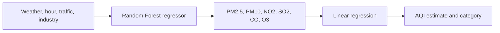

# AWAIR

AWAIR is a reproducible local air quality prediction backend. It estimates six pollutant concentrations from weather and operational context, estimates an Air Quality Index value, and stores prediction history for the mobile product.

This repository is a new personal implementation. It is informed by the machine learning responsibilities I held in the original Bangkit capstone team: preprocessing, feature work, overfitting analysis, linear regression, Random Forest modeling, evaluation, and prediction integration. The original mobile and cloud implementations were produced by their respective team members and are not copied here.

## Why it exists

The earlier team prototype stopped before it became a reproducible public project. This edition focuses on the engineering evidence needed to evaluate the ML work:

- a documented data contract;
- deterministic synthetic data for safe local reproduction;
- chronological evaluation instead of a random split;
- explicit mean baselines;
- a versioned model artifact with dataset fingerprint and library versions;
- input validation, readiness behavior, structured request logs, and Prometheus metrics;
- durable local prediction history with retry-safe writes;
- automated data, training, artifact, database, and API tests.

## Modeling flow



The model is educational and uses synthetic data. Its AQI value and category are not an official health advisory and must not be used for medical, regulatory, or emergency decisions.

## Quick start

Requirements: Python 3.11–3.13 and [uv](https://docs.astral.sh/uv/).

```bash
uv sync --extra dev
uv run awair-generate
uv run awair-train
uv run awair-serve
```

Open the interactive API documentation at `http://127.0.0.1:8000/docs`.

The API creates `runtime/awair.sqlite3` on first use. Set `AWAIR_DATABASE_PATH` to choose another local path.

### Example request

```bash
curl -X POST http://127.0.0.1:8000/predict \
  -H 'Content-Type: application/json' \
  -H 'Idempotency-Key: mobile-request-001' \
  -d '{
    "temperature_c": 30,
    "humidity_pct": 70,
    "wind_speed_mps": 2.5,
    "hour": 8,
    "traffic_index": 0.8,
    "industrial_index": 0.4
  }'
```

## Reproduce evaluation

```bash
uv run awair-generate --rows 4000 --seed 42
uv run awair-train --seed 42
cat artifacts/metrics.json
```

The training command sorts records by timestamp, trains on the first 80%, evaluates on the final 20%, compares both stages with mean baselines, saves `artifacts/model.joblib`, and writes auditable metadata to `artifacts/metrics.json`.

## Verification

```bash
uv run python scripts/check_file_lengths.py
uv run ruff check .
uv run ruff format --check .
uv run pytest
```

## Docker

```bash
docker compose up --build
```

The image generates the deterministic demo data and model during the build, then serves the API on `http://127.0.0.1:8001`. Docker Compose keeps prediction history in a named local volume.

## Operations

| Endpoint | Meaning |
| --- | --- |
| `GET /health` | Process is running; does not require the model |
| `GET /ready` | Model artifact and prediction database are available |
| `POST /predict` | Validated pollutant and AQI prediction |
| `GET /predictions` | Recent prediction history, newest first |
| `GET /predictions/{id}` | One persisted prediction |
| `GET /metrics` | Prometheus request, latency, prediction, and model failure metrics |

## Documentation

- [Architecture](docs/architecture.md)
- [Product scope and acceptance criteria](docs/product-scope.md)
- [Data contract](docs/data-contract.md)
- [Model card](docs/model-card.md)
- [API contract](docs/api.md)
- [Engineering decisions](docs/engineering-decisions.md)
- [Testing and failure handling](docs/testing.md)
- [Phase 4 validation record](docs/validation.md)
- [Security](SECURITY.md)

## Project status

Phase 4 is complete: the data pipeline, reproducible evaluation, versioned model serving, local database, retry-safe prediction history, API contract, observability, and automated integration tests work together. The repository intentionally has no public deployment. The mobile interface remains Phase 5 work. Production use would additionally require validated real sensor data, user identity, monitoring thresholds, authentication, rate limiting, a model approval process, and domain expert review.

## License

[MIT](LICENSE)
