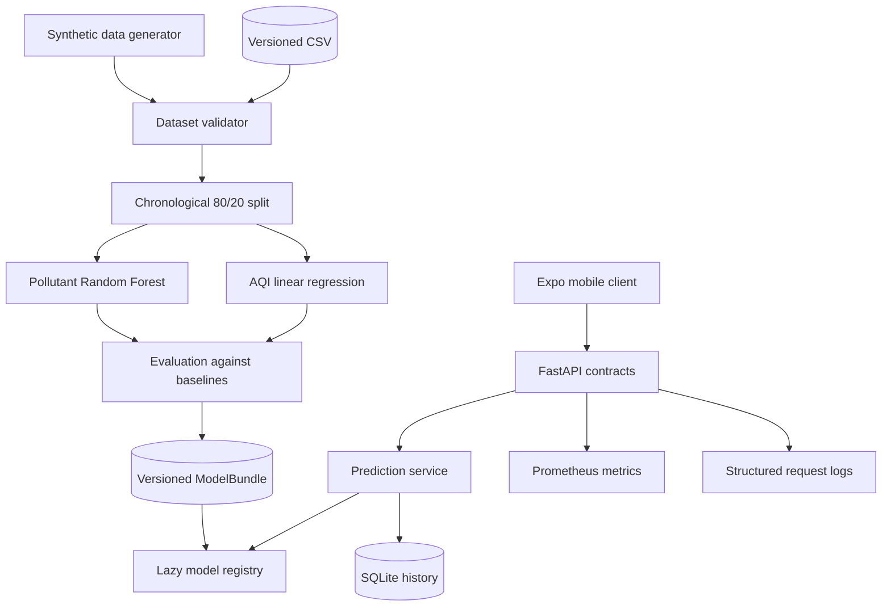

# Architecture

AWAIR separates data preparation, model training, artifact loading, and HTTP serving so each part can be tested independently.

## Boundaries

- `awair.data` generates safe demonstration data and validates external training data.
- `awair.modeling` owns split strategy, estimators, evaluation, and artifact persistence.
- `awair.api` owns HTTP contracts, readiness, telemetry, and safe errors.
- `awair.predictions` coordinates inference and owns SQLite history persistence.
- `awair.cli` provides repeatable generation, training, and serving entrypoints.
- `mobile/app` owns navigation and screen composition while `mobile/src` owns API, storage, validation, configuration, and domain types.

## Artifact lifecycle

Training writes one `ModelBundle` with both fitted pipelines and metadata. The API lazily loads it through a thread safe registry. `/health` stays available when a dependency is missing. `/ready` requires both a valid artifact and writable prediction storage; `/predict` returns `503` when either required dependency is unavailable.

The artifact metadata records the dataset SHA-256, chronological split size, training timestamp, model version, dependency versions, and evaluation metrics. This makes a prediction traceable to one training run without storing personal or sensor data in the artifact.

## Prediction lifecycle

The API validates a request before the prediction service loads the model. A successful inference is persisted with its input, output, model version, generated identifier, and UTC timestamp before a response is returned. History endpoints read the same record shape that `POST /predict` returns, giving the Phase 5 mobile client one stable contract.

Clients may provide an `Idempotency-Key`. Repeating the same key and input returns the first record; reusing the key with different input returns `409`. This lets a mobile client retry after a lost response without duplicating history.

The mobile client caches successful history reads and prediction responses in AsyncStorage. Cache fallback is limited to browsing existing results; new predictions always require the API and model. The configurable API base URL supports a browser preview, simulator, emulator, or physical device on the same local network.

## Failure behavior

- Schema and range violations stop training before estimator fitting.
- Target values cannot be missing or negative.
- Context feature gaps are allowed only up to 10% and are imputed from training medians.
- A missing or invalid artifact is treated as an availability failure, not an application crash.
- An unavailable database makes readiness and history-dependent requests return `503`.
- Unexpected inference failures are logged server side and return a generic response.
- Every response carries a request ID; latency and status are recorded without request payloads.
