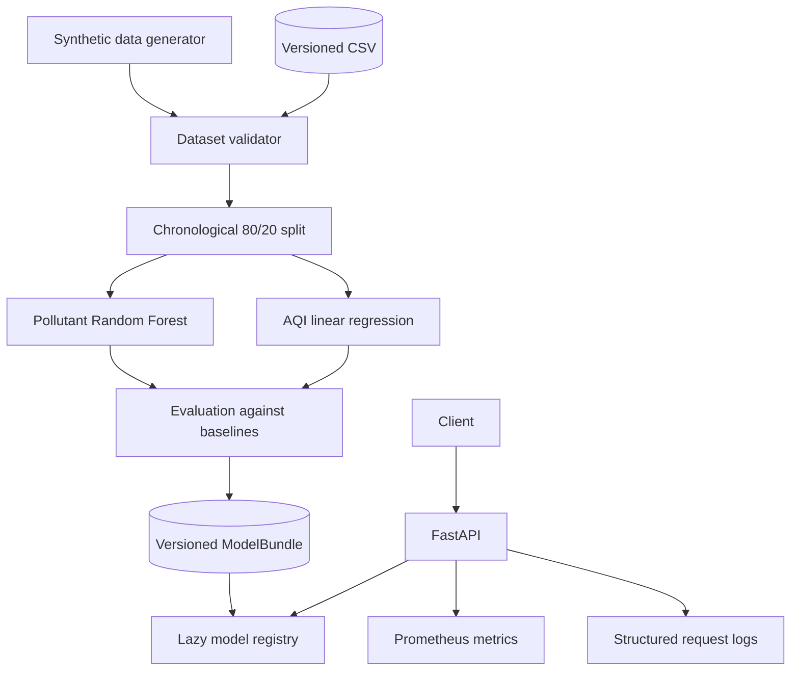

# Architecture

AWAIR separates data preparation, model training, artifact loading, and HTTP serving so each part can be tested independently.

## Boundaries

- `awair.data` generates safe demonstration data and validates external training data.
- `awair.modeling` owns split strategy, estimators, evaluation, and artifact persistence.
- `awair.api` owns request contracts, model readiness, inference, telemetry, and safe errors.
- `awair.cli` provides repeatable generation, training, and serving entrypoints.

## Artifact lifecycle

Training writes one `ModelBundle` with both fitted pipelines and metadata. The API lazily loads it through a thread safe registry. `/health` stays available when the artifact is missing; `/ready` and `/predict` return `503` until a valid artifact can be loaded.

The artifact metadata records the dataset SHA-256, chronological split size, training timestamp, model version, dependency versions, and evaluation metrics. This makes a prediction traceable to one training run without storing personal or sensor data in the artifact.

## Failure behavior

- Schema and range violations stop training before estimator fitting.
- Target values cannot be missing or negative.
- Context feature gaps are allowed only up to 10% and are imputed from training medians.
- A missing or invalid artifact is treated as an availability failure, not an application crash.
- Unexpected inference failures are logged server side and return a generic response.
- Every response carries a request ID; latency and status are recorded without request payloads.
