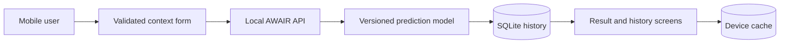

# AWAIR Mobile

The AWAIR mobile client turns the local prediction service into a complete user flow. A user enters weather and activity context, receives an AQI and pollutant estimate, and can revisit cached history when the API is temporarily unavailable.

The estimate is produced from synthetic demonstration data. It is portfolio evidence, not health guidance.

## Product flow



## Screens

- onboarding with the product purpose and limitation;
- prediction form with inline validation and retry-safe submission;
- AQI result with pollutant estimates and model version;
- prediction history backed by the API and device cache;
- prediction detail with the original inputs;
- product information with architecture and responsible-use notes.

## Run locally

Requirements: Node.js 24, pnpm 11, and a running AWAIR API.

```bash
pnpm install
EXPO_PUBLIC_AWAIR_API_URL=http://127.0.0.1:8000 pnpm start
```

Open the project with Expo Go, an emulator, or the web preview. Use `http://10.0.2.2:8000` for an Android emulator. A physical device needs the computer's LAN address and must share its network.

The backend allows the Expo web origins `http://localhost:8081` and `http://127.0.0.1:8081` by default. Set `AWAIR_CORS_ORIGINS` when the web preview uses another origin.

## Quality gate

```bash
pnpm run lint
pnpm run typecheck
pnpm run test
pnpm run export:web
```

The application has no public deployment. The API base URL is configured at build or start time through `EXPO_PUBLIC_AWAIR_API_URL`.
